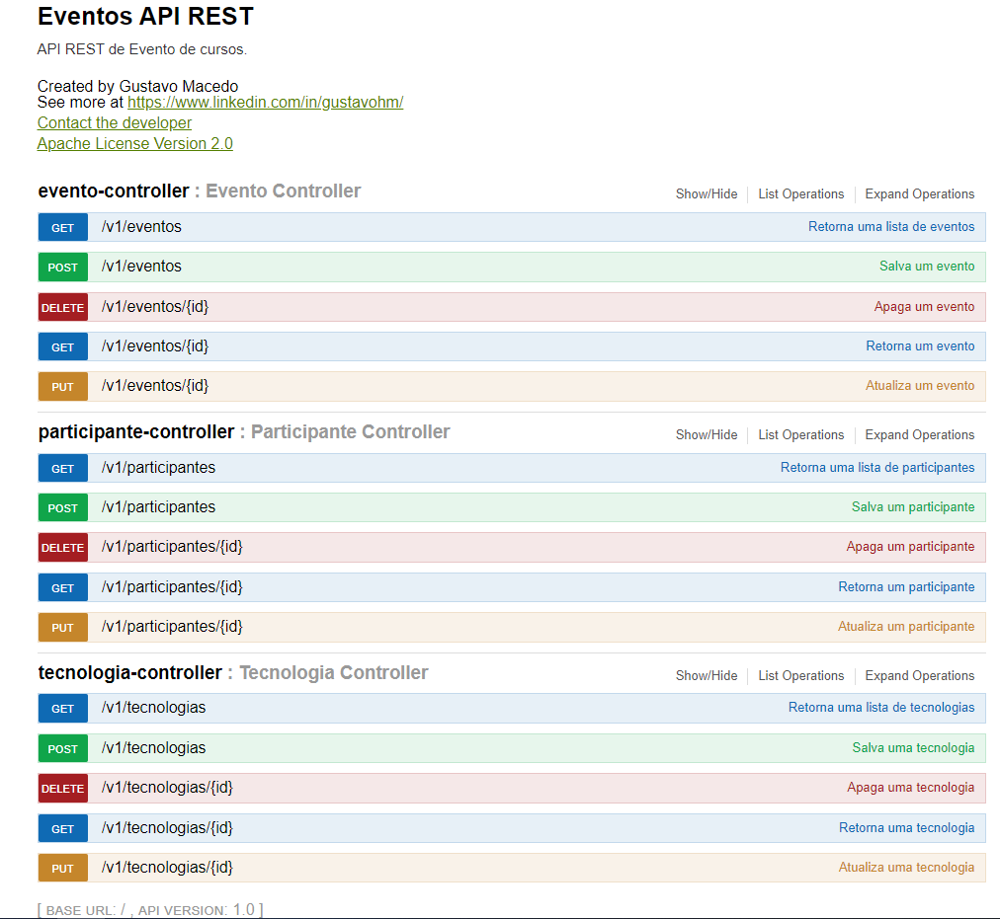

# Projeto estudo REST API  :computer:

   

- Trata-se de um Evento de tecnologias, onde há participantes;

- Evento contém tais campos: Nome, Local, Data, Horário e uma lista de Participantes;

- Participante contém tais campos: Nome e Código de reserva e, como também, ;

- Cada participante tem um Perfil, que pode ser Instrutor ou Aluno, e uma Tecnologia;

- Tecnologia contém tais campos: Nome e descrição;

​       Aplicações utilizadas :gear:

- Java 
- Gerenciador de Dependências: Maven
- IDE: Intellij community
- Project Lombok
- Database H2:  http://localhost:8080/h2-eventos
-  Link da aplicação no Swagger: http://localhost:8080/swagger-ui.html

  

